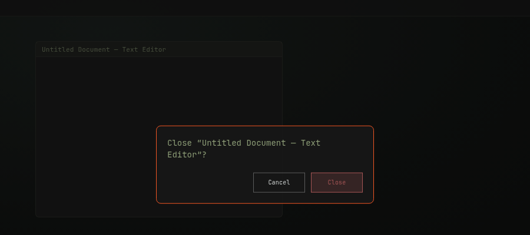

# Omarchy Close Confirm

An [Omarchy](https://omarchy.org/) shell plugin that asks for confirmation
before closing the focused window, instead of closing it instantly.


## Why

By default, closing a window in Omarchy is instant — one accidental keypress
and an unsaved document, terminal session, or form is gone. This plugin adds
a confirmation dialog (Close/Cancel) before the window is actually closed.



*Mockup styled after the shell's default theme tokens (`menu.*` colors),
built for this README — not a live screen capture.*

## What's included

- `manifest.json` + `CloseConfirm.qml` — the shell overlay plugin itself
  (id: `flaviozantut.close-confirm`).
- `bin/omarchy-close-confirm` — a helper script that captures the focused
  window and asks the overlay to confirm before closing it.
- `close-confirm.lua` — unbinds the default SUPER+Q/W close actions and
  rebinds them to the helper script above.

The overlay only reacts when asked to `open`/`toggle` — it does not bind any
key on its own. `close-confirm.lua` is loaded from `~/.config/hypr/bindings.lua`
the same way Omarchy's other keybinding-owning plugins are (see e.g.
`io.github.pablo-merino.altswitch`), so it stays in one file inside the
plugin directory instead of being copy-pasted into your personal bindings.

## Keybindings

Omarchy binds both `SUPER + Q` and `SUPER + W` to the same instant
`Close window` action by default (`tiling.lua`, `hl.dsp.window.close()` —
two keys for keyboard-layout compatibility). `close-confirm.lua` unbinds
both and rebinds them to the confirmation script, so **both shortcuts are
intercepted**, not just one. If you only want to change one of them, or want
different keys, edit `close-confirm.lua` after cloning.

## Install

1. Clone the plugin into your user plugins directory:

   ```bash
   git clone https://github.com/flaviozantut/omarchy-close-confirm.git \
     ~/.config/omarchy/plugins/flaviozantut.close-confirm
   ```

2. Load its keybindings from `~/.config/hypr/bindings.lua`:

   ```lua
   dofile(os.getenv("HOME") .. "/.config/omarchy/plugins/flaviozantut.close-confirm/close-confirm.lua")
   ```

3. Force a plugin rescan if it doesn't pick up automatically:

   ```bash
   omarchy-shell shell rescanPlugins
   ```

## Uninstall

1. Remove the `dofile(...)` line for this plugin from
   `~/.config/hypr/bindings.lua` (this alone restores the default instant
   `SUPER + Q` / `SUPER + W` close, since Hyprland reloads config on save).
2. Remove the plugin directory:

   ```bash
   rm -rf ~/.config/omarchy/plugins/flaviozantut.close-confirm
   ```

3. Force a plugin rescan:

   ```bash
   omarchy-shell shell rescanPlugins
   ```

## Requirements

- Omarchy 4.0.2+ (uses the `hl.dsp`/`hl.dispatch` Lua Hyprland API and the
  stock `ConfirmDialog` shell component).
- `jq` (used by the helper script to parse `hyprctl activewindow -j`).

## License

MIT — see [LICENSE](LICENSE).
